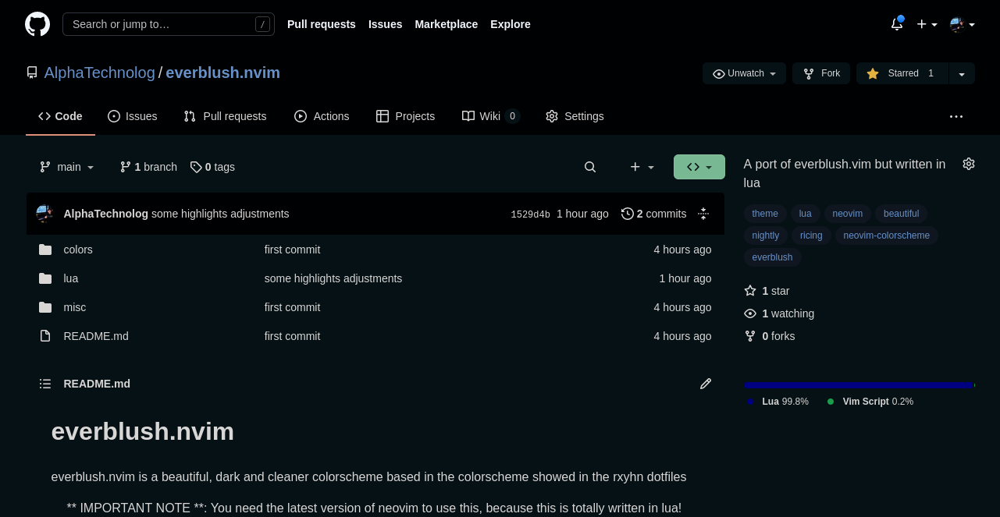

# Night For Github

The night colorscheme is now for github too!

## Installation

### Stylish
1. Install Stylish [Firefox](https://addons.mozilla.org/en-GB/firefox/addon/stylish/)/[Chrome](https://chrome.google.com/webstore/detail/stylish-custom-themes-for/fjnbnpbmkenffdnngjfgmeleoegfcffe) extension.
2. Create a new custom Style that applies to `github.com`.
3. Copy content of [night.css](night.css) and paste to created Style.

### Refined Github
1. Install the extension called [Refined GitHub](https://github.com/refined-github/refined-github)
2. Right Click on the extension
3. Go to options/preferences (depends on the browser)
4. Copy content of [night.css](night.css) and paste to "Custom CSS" box.
